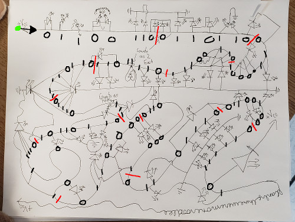

# Short-Circuit

电路的基础知识。
如图中所示，将01统计起来，用ascii解码即可。



```
01100110 01101100 01100001 01100111 01111011 01101111 01110111 01101101 01111001
01101000 01100001 01101110 01100100 01111101
```

flag:
```
flag{owmyhand}
```