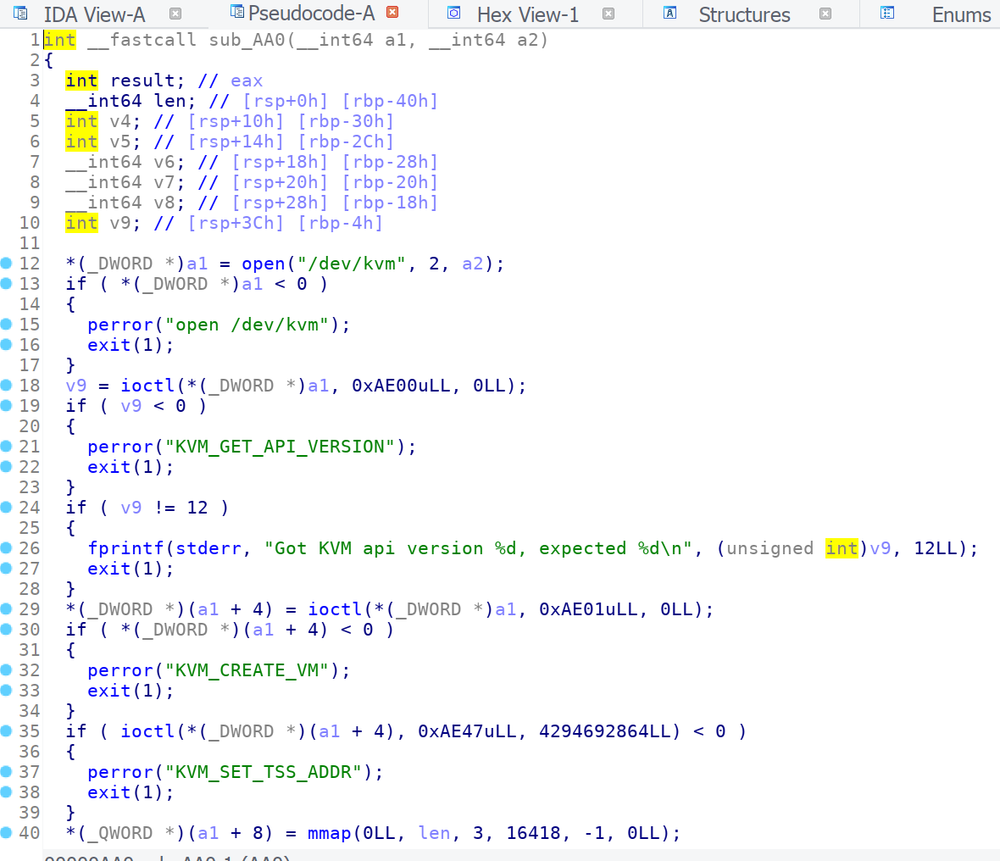
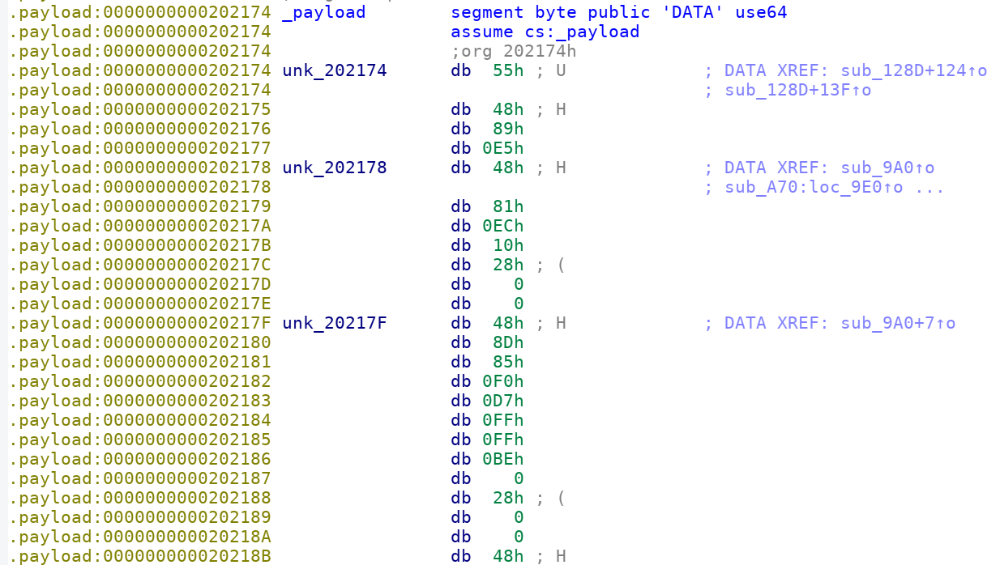
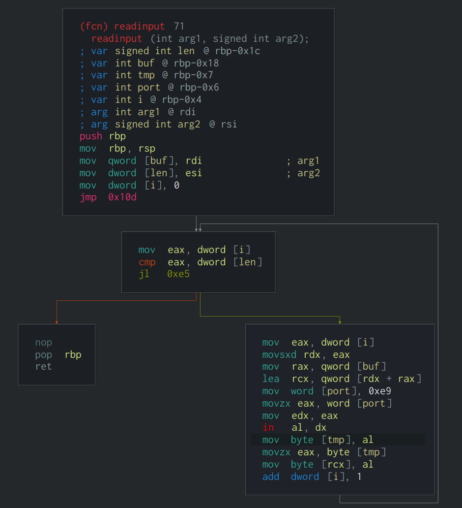
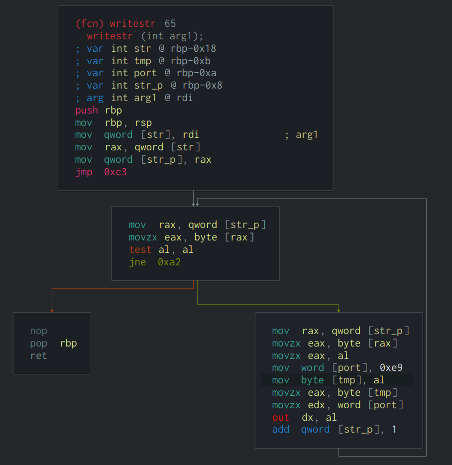
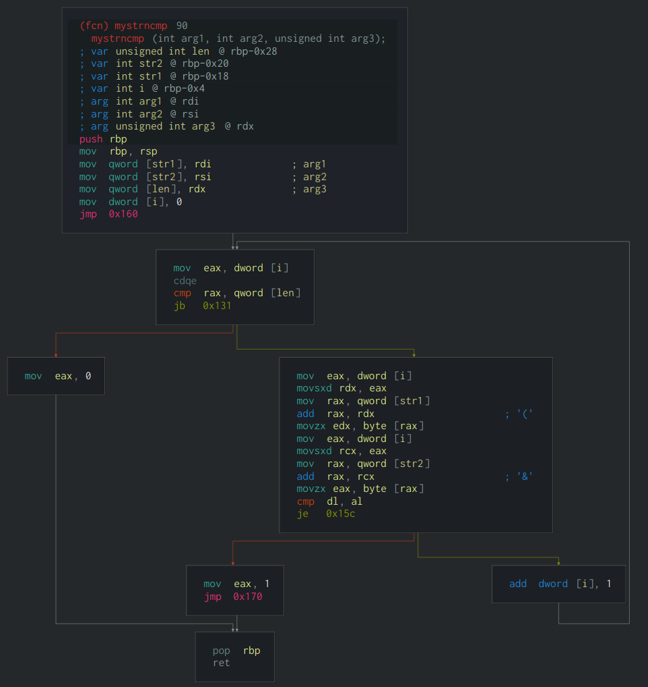
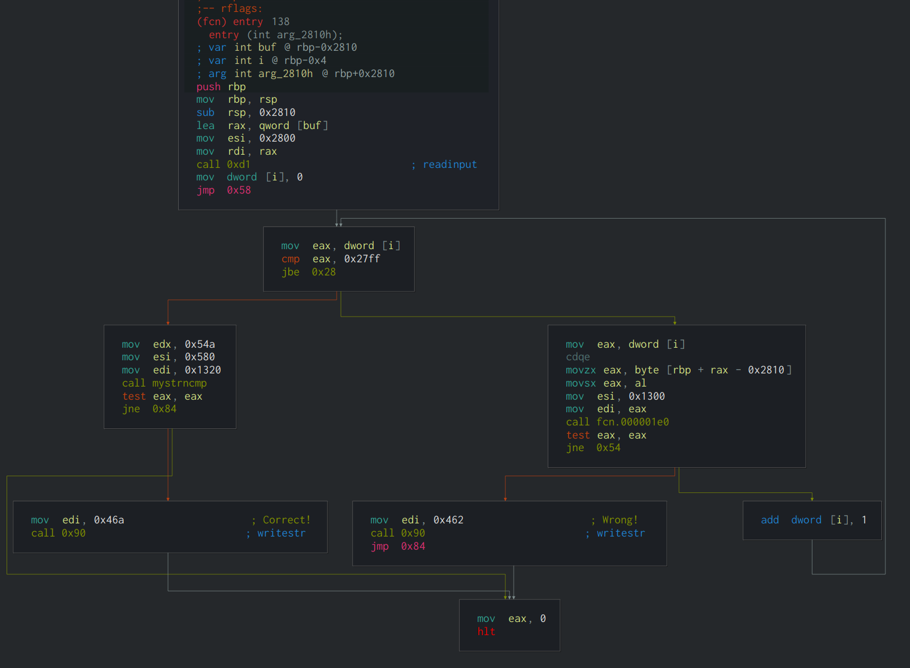
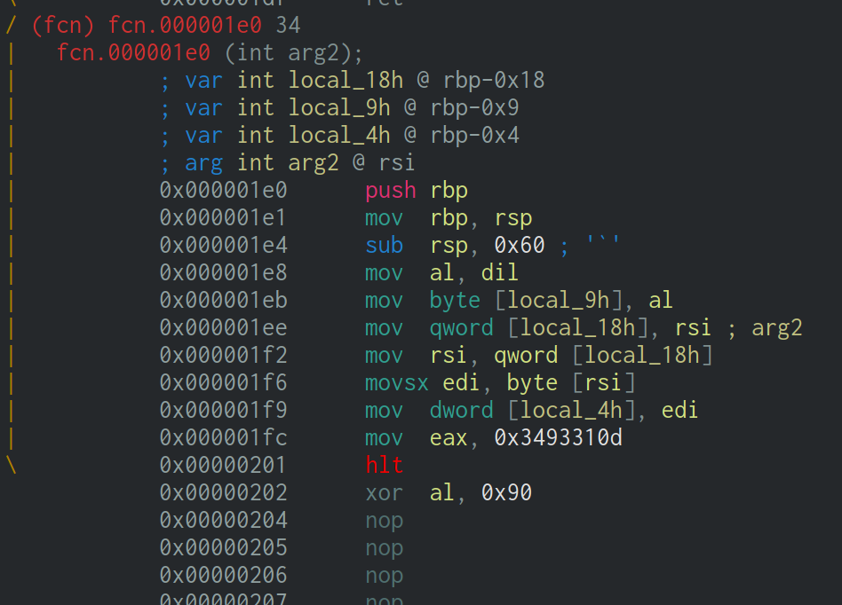
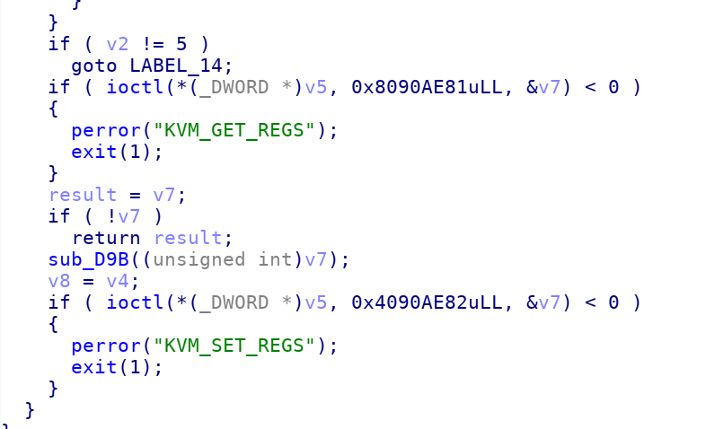
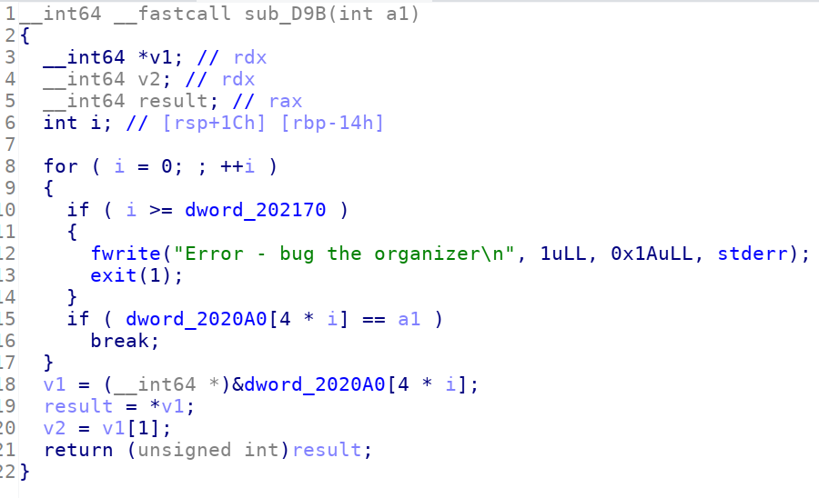

ida打开该程序，可以看到打开了一个`/dev/kvm`的设备，并通过ioctl传递信息


strace跟踪下call

```
$ strace -v ./challenge
openat(AT_FDCWD, "/dev/kvm", O_RDWR)    = 3
ioctl(3, KVM_GET_API_VERSION, 0)        = 12
ioctl(3, KVM_CREATE_VM, 0)              = 4
ioctl(4, KVM_SET_TSS_ADDR, 0xfffbd000)  = 0
mmap(NULL, 2097152, PROT_READ|PROT_WRITE, MAP_PRIVATE|MAP_ANONYMOUS|MAP_NORESERVE, -1, 0) = 0x7fd00ef77000
madvise(0x7fd00ef77000, 2097152, MADV_MERGEABLE) = 0
ioctl(4, KVM_SET_USER_MEMORY_REGION, {slot=0, flags=0, guest_phys_addr=0, memory_size=2097152, userspace_addr=0x7fd00ef77000}) = 0
ioctl(4, KVM_CREATE_VCPU, 0)            = 5
ioctl(3, KVM_GET_VCPU_MMAP_SIZE, 0)     = 12288
mmap(NULL, 12288, PROT_READ|PROT_WRITE, MAP_SHARED, 5, 0) = 0x7fd00f37a000
ioctl(5, KVM_GET_SREGS, {cs={base=0xffff0000, limit=65535, selector=61440, type=11, present=1, dpl=0, db=0, s=1, l=0, g=0, avl=0}, ds={base=0, limit=65535, selector=0, type=3, present=1, dpl=0, db=0, s=1, l=0, g=0, avl=0}, es={base=0, limit=65535, selector=0, type=3, present=1, dpl=0, db=0, s=1, l=0, g=0, avl=0}, fs={base=0, limit=65535, selector=0, type=3, present=1, dpl=0, db=0, s=1, l=0, g=0, avl=0}, gs={base=0, limit=65535, selector=0, type=3, present=1, dpl=0, db=0, s=1, l=0, g=0, avl=0}, ss={base=0, limit=65535, selector=0, type=3, present=1, dpl=0, db=0, s=1, l=0, g=0, avl=0}, tr={base=0, limit=65535, selector=0, type=11, present=1, dpl=0, db=0, s=0, l=0, g=0, avl=0}, ldt={base=0, limit=65535, selector=0, type=2, present=1, dpl=0, db=0, s=0, l=0, g=0, avl=0}, gdt={base=0, limit=65535}, idt={base=0, limit=65535}, cr0=1610612752, cr2=0, cr3=0, cr4=0, cr8=0, efer=0, apic_base=0xfee00900, interrupt_bitmap=[0, 0, 0, 0]}) = 0
ioctl(5, KVM_SET_SREGS, {cs={base=0, limit=4294967295, selector=8, type=11, present=1, dpl=0, db=0, s=1, l=1, g=1, avl=0}, ds={base=0, limit=4294967295, selector=16, type=3, present=1, dpl=0, db=0, s=1, l=1, g=1, avl=0}, es={base=0, limit=4294967295, selector=16, type=3, present=1, dpl=0, db=0, s=1, l=1, g=1, avl=0}, fs={base=0, limit=4294967295, selector=16, type=3, present=1, dpl=0, db=0, s=1, l=1, g=1, avl=0}, gs={base=0, limit=4294967295, selector=16, type=3, present=1, dpl=0, db=0, s=1, l=1, g=1, avl=0}, ss={base=0, limit=4294967295, selector=16, type=3, present=1, dpl=0, db=0, s=1, l=1, g=1, avl=0}, tr={base=0, limit=65535, selector=0, type=11, present=1, dpl=0, db=0, s=0, l=0, g=0, avl=0}, ldt={base=0, limit=65535, selector=0, type=2, present=1, dpl=0, db=0, s=0, l=0, g=0, avl=0}, gdt={base=0, limit=65535}, idt={base=0, limit=65535}, cr0=2147811379, cr2=0, cr3=8192, cr4=32, cr8=0, efer=1280, apic_base=0xfee00900, interrupt_bitmap=[0, 0, 0, 0]}) = 0
ioctl(5, KVM_SET_REGS, {rax=0, rbx=0, rcx=0, rdx=0, rsi=0, rdi=0, rsp=0x200000, rbp=0, r8=0, r9=0, r10=0, r11=0, r12=0, r13=0, r14=0, r15=0, rip=0, rflags=0x2}) = 0
ioctl(5, KVM_RUN, 0)                    = 0
fstat(0, {st_dev=makedev(0, 26), st_ino=4, st_mode=S_IFCHR|0620, st_nlink=1, st_uid=1000, st_gid=5, st_blksize=1024, st_blocks=0, st_rdev=makedev(136, 1), st_atime=1537036280 /* 2018-09-16T02:31:20.548336166+0800 */, st_atime_nsec=548336166, st_mtime=1537036280 /* 2018-09-16T02:31:20.548336166+0800 */, st_mtime_nsec=548336166, st_ctime=1537021307 /* 2018-09-15T22:21:47.548336166+0800 */, st_ctime_nsec=548336166}) = 0
brk(NULL)                               = 0x55d7d8728000
brk(0x55d7d8749000)                     = 0x55d7d8749000
read(0
```
参考[kvm api](https://www.kernel.org/doc/Documentation/virtual/kvm/api.txt)

`openat(AT_FDCWD, "/dev/kvm", O_RDWR) = 3`

打开句柄

`ioctl(3, KVM_GET_API_VERSION, 0) = 12`

检查kvm api的版本

`ioctl(3, KVM_CREATE_VM, 0) = 4`

创建一个vm，fd为4

```
mmap(NULL, 2097152, PROT_READ|PROT_WRITE, MAP_PRIVATE|MAP_ANONYMOUS|MAP_NORESERVE, -1, 0) = 0x7f1cebda8000
madvise(0x7f1cebda8000, 2097152, MADV_MERGEABLE) = 0
ioctl(4, KVM_SET_USER_MEMORY_REGION, {slot=0, flags=0, guest_phys_addr=0, memory_size=2097152, userspace_addr=0x7f1cebda8000}) = 0
```

给vm分配内存空间

`ioctl(4, KVM_CREATE_VCPU, 0) = 5`

创建vcpu

```
ioctl(3, KVM_GET_VCPU_MMAP_SIZE, 0)     = 12288
mmap(NULL, 12288, PROT_READ|PROT_WRITE, MAP_SHARED, 5, 0) = 0x7f1cec1ab000
```

创建vcpu需要的内存空间

`ioctl(5, KVM_SET_SREGS, {cs={base=0, limit=4294967295, selector=8, type=11, present=1, dpl=0, db=0, s=1, l=1, g=1, avl=0}, ds={base=0, limit=4294967295, selector=16, type=3, present=1, dpl=0, db=0, s=1, l=1, g=1, avl=0}, es={base=0, limit=4294967295, selector=16, type=3, present=1, dpl=0, db=0, s=1, l=1, g=1, avl=0}, fs={base=0, limit=4294967295, selector=16, type=3, present=1, dpl=0, db=0, s=1, l=1, g=1, avl=0}, gs={base=0, limit=4294967295, selector=16, type=3, present=1, dpl=0, db=0, s=1, l=1, g=1, avl=0}, ss={base=0, limit=4294967295, selector=16, type=3, present=1, dpl=0, db=0, s=1, l=1, g=1, avl=0}, tr={base=0, limit=65535, selector=0, type=11, present=1, dpl=0, db=0, s=0, l=0, g=0, avl=0}, ldt={base=0, limit=65535, selector=0, type=2, present=1, dpl=0, db=0, s=0, l=0, g=0, avl=0}, gdt={base=0, limit=65535}, idt={base=0, limit=65535}, cr0=2147811379, cr2=0, cr3=8192, cr4=32, cr8=0, efer=1280, apic_base=0xfee00900, interrupt_bitmap=[0, 0, 0, 0]}) = 0`


`ioctl(5, KVM_SET_REGS, {rax=0, rbx=0, rcx=0, rdx=0, rsi=0, rdi=0, rsp=0x200000, rbp=0, r8=0, r9=0, r10=0, r11=0, r12=0, r13=0, r14=0, r15=0, rip=0, rflags=0x2}) = 0`

初始化寄存器和context进程上下文的内容

`ioctl(5, KVM_RUN, 0) = 0`

跑kvm了，vm起来之后程序会接受输入，并且每次执行下
`ioctl(5, KVM_RUN, 0)`

用frace去跟踪kvm

```
# echo 1 > /sys/kernel/debug/tracing/events/kvm/enable
# cat /sys/kernel/debug/tracing/trace_pipe
       challenge-24797 [003] .... 83184.290314: kvm_fpu: load
       challenge-24797 [003] .... 83184.290322: kvm_pio: pio_read at 0xe9 size 1 count 1 val 0x31
       challenge-24797 [003] d..1 83184.290326: kvm_entry: vcpu 0
       challenge-24797 [003] .... 83184.290332: kvm_exit: reason EXTERNAL_INTERRUPT rip 0x100 info 0 800000f6
       challenge-24797 [003] d..1 83184.290334: kvm_entry: vcpu 0
       challenge-24797 [003] .... 83184.290337: kvm_exit: reason IO_INSTRUCTION rip 0xff info e90008 0
       challenge-24797 [003] .... 83184.290339: kvm_fpu: unload
       challenge-24797 [003] .... 83184.290341: kvm_userspace_exit: reason KVM_EXIT_IO (2)
       challenge-24797 [003] .... 83184.290380: kvm_fpu: load
       challenge-24797 [003] .... 83184.290381: kvm_pio: pio_read at 0xe9 size 1 count 1 val 0x32
       challenge-24797 [003] d..1 83184.290382: kvm_entry: vcpu 0
       challenge-24797 [003] .... 83184.290384: kvm_exit: reason IO_INSTRUCTION rip 0xff info e90008 0
       challenge-24797 [003] .... 83184.290385: kvm_fpu: unload
       challenge-24797 [003] .... 83184.290386: kvm_userspace_exit: reason KVM_EXIT_IO (2)
       challenge-24797 [003] .... 83184.290413: kvm_fpu: load
       challenge-24797 [003] .... 83184.290413: kvm_pio: pio_read at 0xe9 size 1 count 1 val 0x33
       challenge-24797 [003] d..1 83184.290414: kvm_entry: vcpu 0
       challenge-24797 [003] .... 83184.290416: kvm_exit
```
KVM 调用 pio_read() 接收输入

看cs初始化的内容，我们可以知道kvm是从地址0开始执行的。


通过ltrace跟踪可以看到
有部分内容被拷贝到kvm的0地址。

```
$ ltrace ./challenge
memcpy(0x7f3f247a9000, "UH\211\345H\201\354\020(\0\0H\215\205\360\327\377\377\276\0(\0\0H\211\307\350\262\0\0\0\307"..., 4888) = 0x7f3f247a9000
```
长度为 4888



提取这部分二进制，反编译看下







通过分析可以看到在0x1e0中进行了check



vm会很快退出，然后程序会修改它的rip然后重新启动



strace跟踪看下

```
$ strace -vo log ./challenge < input
$ less log
...
ioctl(5, KVM_RUN, 0)                    = 0
ioctl(5, KVM_GET_REGS, {rax=0x3493310d, rbx=0, rcx=0x1fffe7, rdx=0xe9, rsi=0x1300, rdi=0xffffffff, rsp=0x1fd778, rbp=0x1fd7d8, r8=0, r9=0, r10=0, r11=0, r12=0, r13=0, r14=0, r15=0, rip=0x202, rflags=0x6}) = 0
ioctl(5, KVM_SET_REGS, {rax=0x3493310d, rbx=0, rcx=0x1fffe7, rdx=0xe9, rsi=0x1300, rdi=0xffffffff, rsp=0x1fd778, rbp=0x1fd7d8, r8=0, r9=0, r10=0, r11=0, r12=0, r13=0, r14=0, r15=0, rip=0x32c, rflags=0x6}) = 0
ioctl(5, KVM_RUN, 0)                    = 0
ioctl(5, KVM_GET_REGS, {rax=0x5de72dd, rbx=0, rcx=0x5de72dd, rdx=0xffffffff, rsi=0x1300, rdi=0xffffffff, rsp=0x1fd778, rbp=0x1fd7d8, r8=0, r9=0, r10=0, r11=0, r12=0, r13=0, r14=0, r15=0, rip=0x342, rflags=0x46}) = 0
ioctl(5, KVM_SET_REGS, {rax=0x5de72dd, rbx=0, rcx=0x5de72dd, rdx=0xffffffff, rsi=0x1300, rdi=0xffffffff, rsp=0x1fd778, rbp=0x1fd7d8, r8=0, r9=0, r10=0, r11=0, r12=0, r13=0, r14=0, r15=0, rip=0x347, rflags=0x46}) = 0
ioctl(5, KVM_RUN, 0)                    = 0
...
ioctl(5, KVM_GET_REGS, {rax=0x968630d0, rbx=0, rcx=0x5de72dd, rdx=0x30, rsi=0xae0, rdi=0x30, rsp=0x1fd628, rbp=0x1fd688, r8=0, r9=0, r10=0, r11=0, r12=0, r13=0, r14=0, r15=0, rip=0x342, rflags=0x13}) = 0
ioctl(5, KVM_SET_REGS, {rax=0x968630d0, rbx=0, rcx=0x5de72dd, rdx=0x30, rsi=0xae0, rdi=0x30, rsp=0x1fd628, rbp=0x1fd688, r8=0, r9=0, r10=0, r11=0, r12=0, r13=0, r14=0, r15=0, rip=0x400, rflags=0x13}) = 0
ioctl(5, KVM_RUN, 0)                    = 0
ioctl(5, KVM_GET_REGS, {rax=0xef5bdd13, rbx=0, rcx=0x8f6e2804, rdx=0xae0, rsi=0x30, rdi=0x61, rsp=0x1fd628, rbp=0x1fd688, r8=0, r9=0, r10=0, r11=0, r12=0, r13=0, r14=0, r15=0, rip=0x41d, rflags=0x97}) = 0
ioctl(5, KVM_SET_REGS, {rax=0xef5bdd13, rbx=0, rcx=0x8f6e2804, rdx=0xae0, rsi=0x30, rdi=0x61, rsp=0x1fd628, rbp=0x1fd688, r8=0, r9=0, r10=0, r11=0, r12=0, r13=0, r14=0, r15=0, rip=0x435, rflags=0x97}) = 0
ioctl(5, KVM_RUN, 0)                    = 0
ioctl(5, KVM_GET_REGS, {rax=0x5f291a64, rbx=0, rcx=0x8f6e2804, rdx=0xae0, rsi=0x30, rdi=0x61, rsp=0x1fd628, rbp=0x1fd688, r8=0, r9=0, r10=0, r11=0, r12=0, r13=0, r14=0, r15=0, rip=0x43b, rflags=0x97}) = 0
ioctl(5, KVM_SET_REGS, {rax=0x5f291a64, rbx=0, rcx=0x8f6e2804, rdx=0xae0, rsi=0x30, rdi=0x61, rsp=0x1fd628, rbp=0x1fd688, r8=0, r9=0, r10=0, r11=0, r12=0, r13=0, r14=0, r15=0, rip=0x441, rflags=0x97}) = 0
ioctl(5, KVM_RUN, 0)                    = 0
ioctl(5, KVM_GET_REGS, {rax=0xc50b6060, rbx=0, rcx=0x8f6e2804, rdx=0xae0, rsi=0x30, rdi=0x61, rsp=0x1fd628, rbp=0x1fd688, r8=0, r9=0, r10=0, r11=0, r12=0, r13=0, r14=0, r15=0, rip=0x44e, rflags=0x97}) = 0
ioctl(5, KVM_SET_REGS, {rax=0xc50b6060, rbx=0, rcx=0x8f6e2804, rdx=0xae0, rsi=0x30, rdi=0x61, rsp=0x1fd628, rbp=0x1fd688, r8=0, r9=0, r10=0, r11=0, r12=0, r13=0, r14=0, r15=0, rip=0x454, rflags=0x97}) = 0
ioctl(5, KVM_RUN, 0)                    = 0
```

程序会根据rax的值来修改rip,检测的数组位于0x2020A0




对应关系如下：

```
rax        =>  rip
0x3493310d => 0x32c
0x5de72dd  => 0x347
0x968630d0 => 0x400
0xef5bdd13 => 0x435
0x5f291a64 => 0x441
0xc50b6060 => 0x454
0x8aeef509 => 0x389
0x9d1fe433 => 0x3ed
0x54a15b03 => 0x376
0x8f6e2804 => 0x422
0x59c33d0f => 0x3e1
0x64d8a529 => 0x3b8
0x5de72dd  => 0x347
0xfc2ff49f => 0x3ce
```

patch所有的halt，然后ida看下

```c
void __noreturn main()
{
  char a1[10252]; // [rsp+0h] [rbp-2810h]
  unsigned int i; // [rsp+280Ch] [rbp-4h]

  gets(a1, 10240);
  for ( i = 0; i <= 0x27FF; ++i )
  {
    if ( !generateBuf1(a1[i], &rootNode) )
    {
      puts("Wrong!\n");
      goto returnZero;
    }
  }
  if ( !bufs_unequal(0x54AuLL, buf1, buf2) )
    puts("Correct!\n");
returnZero:
  __halt();
  JUMPOUT(*(_QWORD *)j_returnZero);
}
// return 1 if found
int __fastcall generateBuf1(char charFromInput, tree_t *node)
{
  if ( SLOBYTE(node->value) != -1 )             // leaf
    return SLOBYTE(node->value) == charFromInput;
  if ( generateBuf1(charFromInput, node->left) == 1 )
  {
    appendBit(0);
    return 1;
  }
  if ( generateBuf1(charFromInput, node->right) != 1 )
    return 0;
  appendBit(1);
  return 1;
}
struct __attribute__((aligned(16))) tree_t
{
  _QWORD value;
  tree_t *left;
  tree_t *right;
};
```
可以看到是根据我们的输入去遍历二叉树，遍历的叶子节点去填充Buf,然后这个Buf跟正确的值去比较。
爆破行不通，最后尝试根据一些已知的单词手动替换二进制字符串

```
flag.txt11111111111111111111111111111111111111111111111111111111111111111111111111111111111111111111000000000000
1101101101100001110100000000001100100010110010000010000000000110010001011001000001000000000000000000000000000100
0100110010110000001000001000011101101100000100001110000100010110110110110100001100011001101100000111101011111000
0111111111111111111111111111111111111111111111111111111111111111111111111111111111111111111111111111111011100101
1011100100110101101011110111101111001010001011010011101100101111111111111111111111111111110010100010110100111011
0010111111111111111111111111111111111111111111111111111111111111111111111111111111111111111111111111111111111111
1111111111111111111111111111111111111111111111111111111111111111111111111111flag{who would win?  100 ctf teams o
r 1 obfuscat3d boi?}0011101011111111
```

最终得到`flag{who would win?  100 ctf teams or 1 obfuscat3d boi?}`

```python
#!/usr/bin/env python3

table = {
    '0': '000',
    'w': '000100',
    '}': '0100100',
    '5': '1100100',
    'o': '10100',
    '1': '01100',
    't': '11100',
    '3': '000010',
    '7': '100010',
    'f': '010010',
    'i': '110010',
    '?': '0001010',
    'c': '1001010',
    'b': '0101010',
    'd': '1101010',
    'g': '0011010',
    'r': '1011010',
    '\n': '00111010',
    '.': '10111010',
    '2': '01111010',
    'e': '11111010',
    'm': '00000110',
    'n': '10000110',
    'x': '01000110',
    '{': '11000110',
    'a': '100110',
    's': '010110',
    '6': '110110',
    '4': '0001110',
    'h': '1001110',
    'l': '0101110',
    'u': '1101110',
    ' ': '11110',
    '\': '1',
}

data = None
flag = ""
with open("dump", "rb") as f:
    f.seek(0x580)
    data = f.read(0x54a)

data = data[:146]

binstr = ""
for b in data:
    binstr += bin(b)[2:].rjust(8, '0')[::-1]
"""
for i in range(2000):
    matched = []
    for char, code in table.items():
        if binstr.startswith(code):
            matched.append((code, char))
    if len(matched) == 0:
        binstr = binstr[1:]
        continue
    code, char = min(matched, key=lambda t: t[0])
    binstr = binstr.replace(code, '', 1)
    flag += char
    print(flag, binstr)
"""


def rep(a, b):
    s = ""
    for c in b:
        s += table[c]
    return a.replace(s, b)


#print(binstr)
binstr = rep(binstr, "flag.txt")
binstr = rep(binstr, "flag{")
binstr = rep(binstr, "would ")
binstr = rep(binstr, "who ")
binstr = rep(binstr, "or ")
binstr = rep(binstr, "win?  ")
binstr = rep(binstr, "obfuscat3d ")
binstr = rep(binstr, " ctf ")
binstr = rep(binstr, "teams ")
binstr = rep(binstr, "1 ")
binstr = rep(binstr, "100")
binstr = rep(binstr, "boi?")
binstr = rep(binstr, "}")
print(binstr)
```

