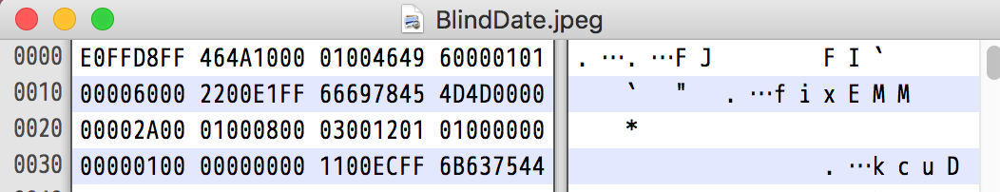
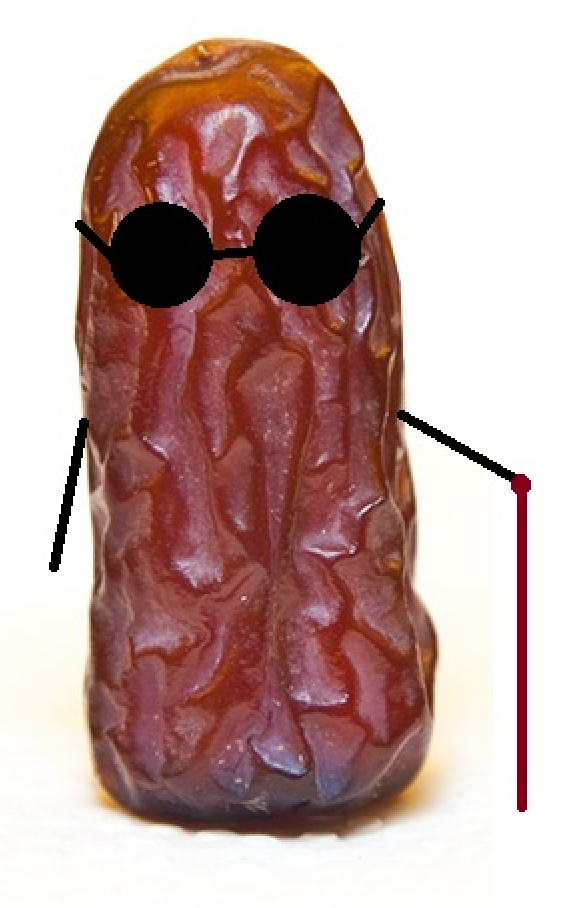
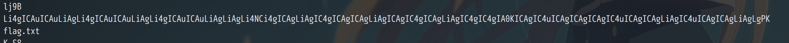
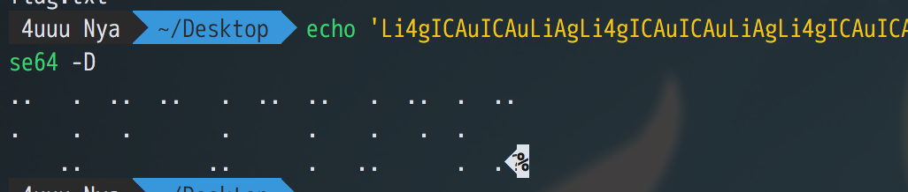

# Blind Date

给的题目附件打不开，用HexEditor打开后仔细看了看，发现了点端倪

图片后缀是jpeg，那么这个文件头应该是JFIF，而且确实看到有JFIF字样，但是位置很奇怪

正常图片的文件头应该是 FFD8FFE0 ，而这个却是 E0FFD8FF 好像是反过来了？

于是写了个脚本验证猜测，将其中的顺序都倒序了一遍，得到了一张能正常打开的图片

看到戴着墨镜，题目名为Blind，猜到会不会是有盲文，binwalk可以分解出来一个zip包，但是有爆破不出来的密码，问了管理员说是不需要爆破，应该是忽略了什么信息，于是看到图片内容，会发现有一串奇怪的字符串

解Base64后发现就是盲文

对照着盲文表得到 `f4c3p4lm`，作为解压密码解开分解出来的zip(解不开，把字母换成大写才能解开。。)，其中flag.txt内容是brainfuck，随便找个解释器得到flag