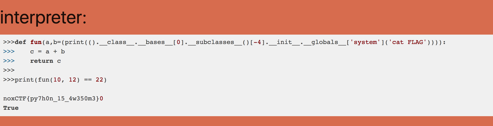

# Python for fun 2

较于python for fun，这个做了很多过滤，而且是基于python3, 相对来说网上只有python2的资料，所以其中的组件需要自己去寻找

虽然过滤了很多关键字，但其实测试一下不难发现，很多能用的东西并没有被过滤，只有python中的常见关键字被过滤掉了，仍然可以使用baseclass来按需获取

所以一个一个找，后面发现了有os，于是选择直接用system去执行系统命令读flag

