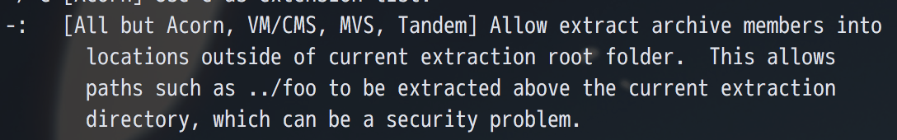
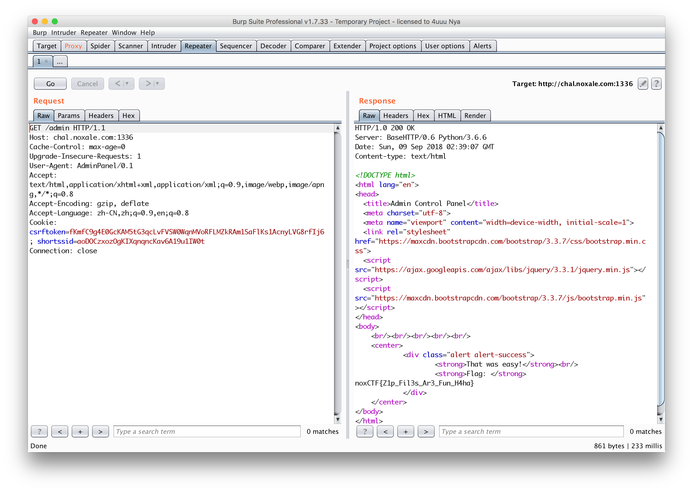

# Slippery Situation

页面上有很长一段话

```
ou upload a zip file, our servers extract the file using bash command "unzip -: file.zip"
the server scans the files inside and returns results!
We dont believe in containers, all zip files are uploaded to /files/ directory and get extracted there for maximum security!
```

可以得到两个有用的信息，第一个是会用unzip -: file.zip进行解压，其次是将文件都放在了/files/下

可以看到用了 unzip -: ，没见过这个option，于是看了下unzip的帮助信息



然后就没有然后了。。 随便上传一个zip也只是返回一条信息，于是看了看网页源码，得到一个信息

`<!-- Note to self : admin page link : /admin-->`

访问admin后是一个登录，但是功能被禁用掉了，在admin的页面还能看到另外一个信息

`<!-- Note to self so i wont forget : if a file named key.txt containing the short ssid is found in the ./admin directory then you dont need to login with user and pass to save time -->`

可以发现cookie中带了一个shortssid，其实这时已经很明了了，前面unzip的-:就是为了这个地方开的便利。

将自己的shortssid放到key.txt中，然后压一个包

```bash
zip -r 1.zip ../admin/key.txt
```

上传后访问admin会发现有一串base64

`VGhpcyBwYWdlIGlzIG9ubHkgYXZhaWxhYmxlIGZvciBBZG1pblBhbmVsIGJyb3dzZXIgdXNlcnMuDQoNCkFkbWluUGFuZWwvMC4xIGFnZW50IHVzZXJzIG9ubHkh`

解开后得到

```
This page is only available for AdminPanel browser users.

AdminPanel/0.1 agent users only!
```

修改下UA再访问就可以得到flag了

