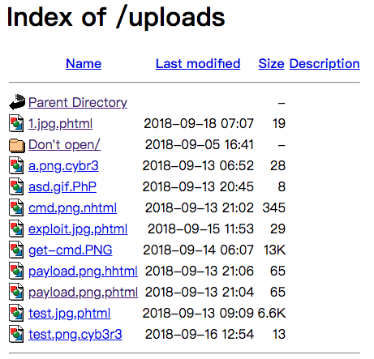
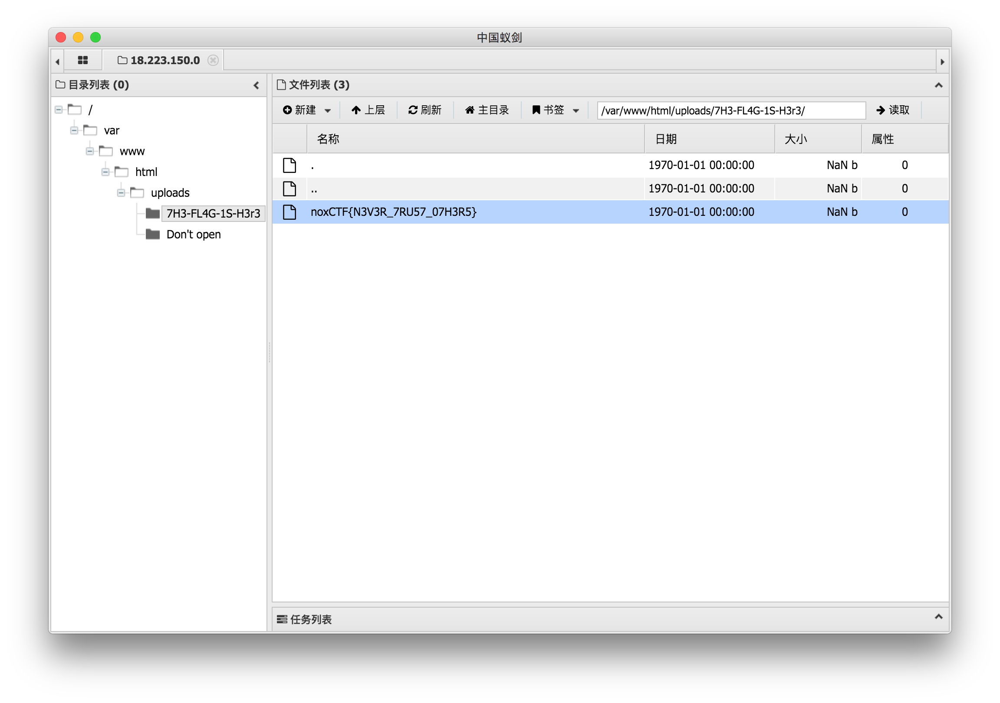

# MyFileUploder

随便上传一个文件后给出了文件上传后的地址，访问后发现在 `uploads` 文件夹下

去掉文件名发现 `uploads` 文件夹可以列目录

访问 htaccess 文件得到以下内容



访问 `Don't open` 文件夹后发现存在htaccess文件，内容为

```
Options +Indexes
AddType application/x-httpd-php .cyb3r
```

于是构造一个文件名为 `1.jpg.cyb3r` 的shell，在 `7H3-FL4G-1S-H3r3` 目录中找到flag

