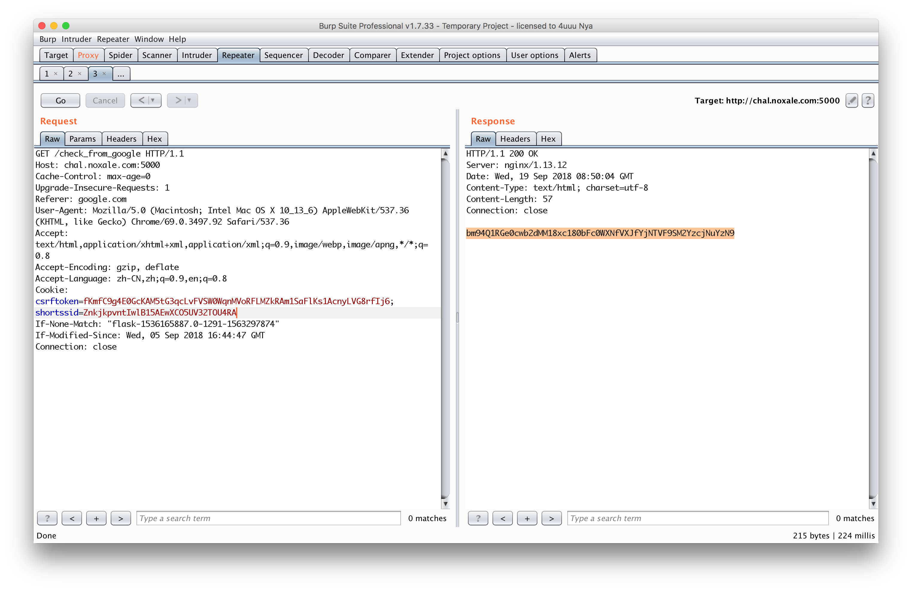
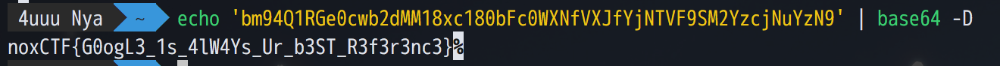

# Reference

访问页面后打印了一句话：   `where the **** did you come from?`

然后查看源码发现 `index.js` 

```javascript
$( document ).ready(function() {
    $.ajax({
        url: "check_from_google",
        data: NaN,
        success: function(result) {
            $("#status").html("hello old friend! " + atob(result))        
        },
        dataType: NaN
    }).fail(function() {
        $("#status").html("where the **** did you come from?")
    });
});
```

看到请求的url为: `check_from_google`， 猜想需要修改来源页为google，使用burpsuite修改后看到一串字符串



base64解码后得到flag 

