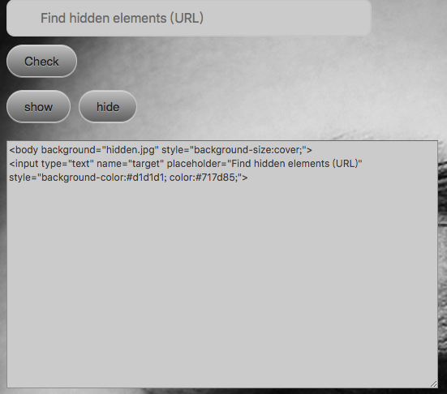
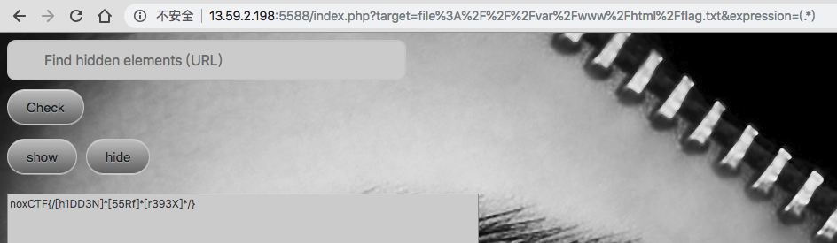

# hiddenDOM

看到是一个请求连接，于是直接请求 `http://127.0.0.1` 测试是否SSRF



发现有返回，但是内容却不完整，查看了一下当前页面源码，发现有一个元素

```html
<a href='/var/www/html/flag.txt' hidden>-_-</a>
```

这样差不多就能确定是ssrf，但是直接 file 协议读取返回空

注意到源码中还有一段JS

```javascript
var _0x3bc3=["\x6D\x61\x69\x6E\x5F\x66\x6F\x72\x6D","\x67\x65\x74\x45\x6C\x65\x6D\x65\x6E\x74\x42\x79\x49\x64","\x69\x6E\x70\x75\x74","\x63\x72\x65\x61\x74\x65\x45\x6C\x65\x6D\x65\x6E\x74","\x6E\x61\x6D\x65","\x65\x78\x70\x72\x65\x73\x73\x69\x6F\x6E","\x73\x65\x74\x41\x74\x74\x72\x69\x62\x75\x74\x65","\x74\x79\x70\x65","\x74\x65\x78\x74","\x70\x6C\x61\x63\x65\x68\x6F\x6C\x64\x65\x72","\x2F\x3C\x5B\x5E\x3C\x3E\x5D\x7B\x31\x2C\x7D\x68\x69\x64\x64\x65\x6E\x5B\x5E\x3C\x3E\x5D\x7B\x31\x2C\x7D\x3E\x2F"];
var _frss=document[_0x3bc3[1]](_0x3bc3[0]);
var _xEger=document[_0x3bc3[3]](_0x3bc3[2]);
_xEger[_0x3bc3[6]](_0x3bc3[4],_0x3bc3[5]);
_xEger[_0x3bc3[6]](_0x3bc3[7],_0x3bc3[8]);
_xEger[_0x3bc3[6]](_0x3bc3[9],_0x3bc3[10])
```

解码一下得到

```javascript
var _0x3bc3 = ["main_form", "getElementById", "input", "createElement", "name", "expression", "setAttribute", "type", "text", "placeholder", "/<[^<>]{1,}hidden[^<>]{1,}>/"]
var _frss = document["getElementById"]("main_form"); 
var _xEger = document["createElement"]("input");
_xEger["setAttribute"]("name", "expression");
_xEger["setAttribute"]("type", "text"); 
_xEger["setAttribute"]("placeholder", "/<[^<>]{1,}hidden[^<>]{1,}>/");
```

差不多可以看到这段js是创建了一个input

```
<form id="main_form" action="index.php" style="position:sticky;">
<input name="expression" placeholder="/<[^<>]{1,}hidden[^<>]{1,}>/" type="text">
```

这里可以看到 expression 的字段，是用来查找hidden元素的，而且是使用了这个正则来进行查询，那么传入 expression 这个参数，修改一下正则，就可以得到flag了

